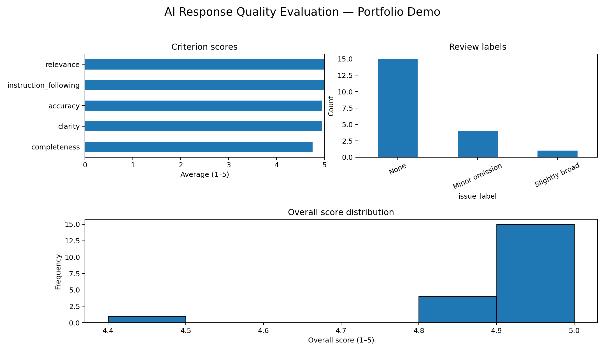
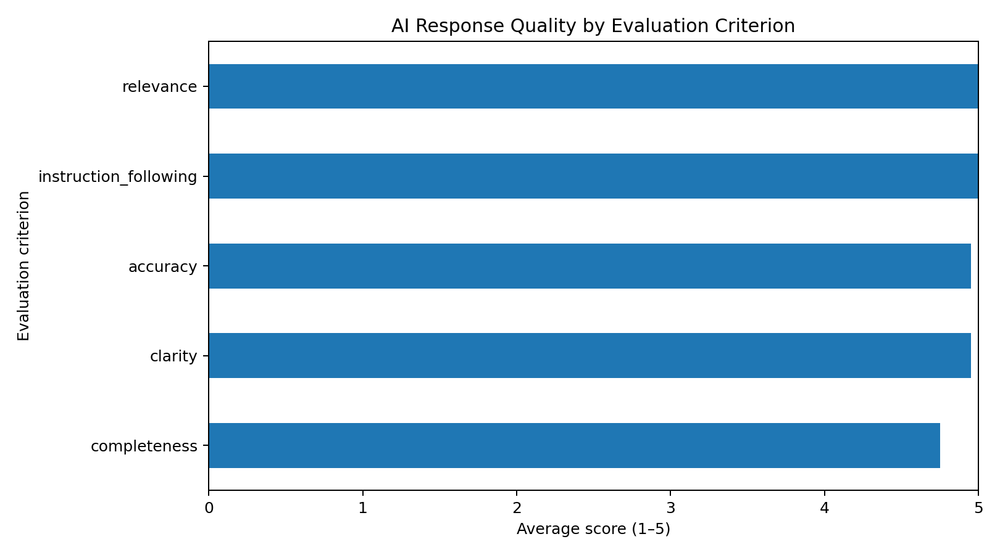
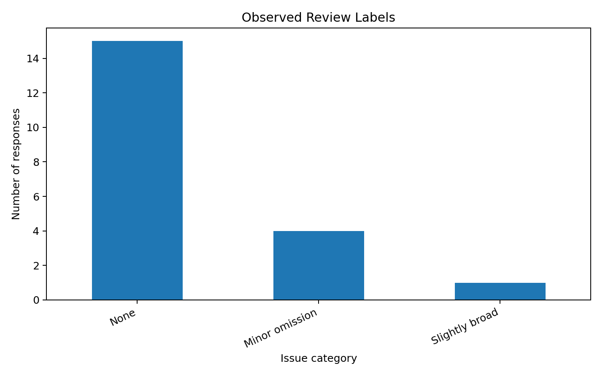
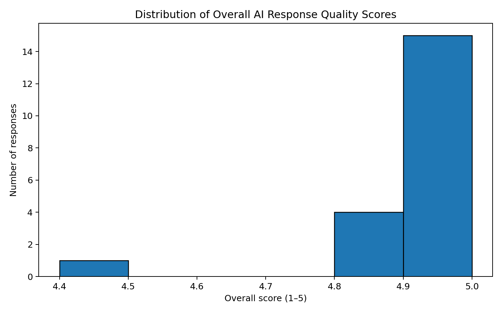

# AI Response Quality Evaluation

A portfolio project demonstrating a structured approach to evaluating AI-generated responses for **accuracy, relevance, completeness, instruction-following, and clarity**.

> **Important:** The included dataset is synthetic portfolio/demo data. It is not presented as proprietary client work or professional employment evidence.

## Project objective

AI systems can produce responses that look convincing while still containing factual errors, omissions, irrelevant content, or failures to follow instructions. This project demonstrates a repeatable quality-assurance workflow:

1. Review each response against a defined rubric.
2. Score five quality dimensions on a 1–5 scale.
3. Record an issue category when a response needs attention.
4. Calculate an overall quality score.
5. Produce summary metrics and visualizations.
6. Use the results to identify patterns that could guide further review.

## Evaluation rubric

| Criterion | What it measures |
|---|---|
| Accuracy | Whether the response is factually correct |
| Relevance | Whether it directly addresses the prompt |
| Completeness | Whether important requested information is included |
| Instruction following | Whether explicit requirements are followed |
| Clarity | Whether the response is understandable and well structured |

Each criterion is scored from **1 (poor) to 5 (excellent)**.

## Repository structure

```text
ai-response-quality-evaluation/
├── data/
│   └── sample_ai_responses.csv
├── docs/
│   └── evaluation_methodology.md
├── outputs/
│   ├── criterion_scores.png
│   ├── issue_categories.png
│   ├── score_distribution.png
│   ├── scored_responses.csv
│   ├── criterion_summary.csv
│   └── issue_summary.csv
├── src/
│   └── run_analysis.py
├── .gitignore
├── README.md
└── requirements.txt
```

## How to run

### 1. Clone the repository

```bash
git clone https://github.com/YOUR-USERNAME/ai-response-quality-evaluation.git
cd ai-response-quality-evaluation
```

### 2. Install dependencies

```bash
python -m pip install -r requirements.txt
```

### 3. Run the analysis

```bash
python src/run_analysis.py
```

The script writes scored records, summary CSV files, and PNG visualizations into `outputs/`.

## Example findings

The demo dataset is intentionally small and synthetic. Running the analysis produces:

- Average score for each evaluation criterion
- Distribution of overall response scores
- Counts of observed review labels
- A scored response-level dataset for further inspection

The purpose is to demonstrate the **evaluation workflow**, not to make claims about real-world model performance.

## Skills demonstrated

- Python
- Pandas
- Data validation
- Structured quality assurance
- Rubric design
- Error categorization
- Exploratory data analysis
- Data visualization
- Technical documentation
- Reproducible analysis

## Possible next improvements

- Add inter-rater agreement metrics such as Cohen's kappa
- Add a second independent reviewer
- Introduce confidence scores
- Add automated checks for empty or duplicate responses
- Compare multiple AI models using the same rubric
- Add a Streamlit review interface

## Portfolio overview



## Sample visualizations

### Criterion scores



### Review labels



### Overall score distribution


